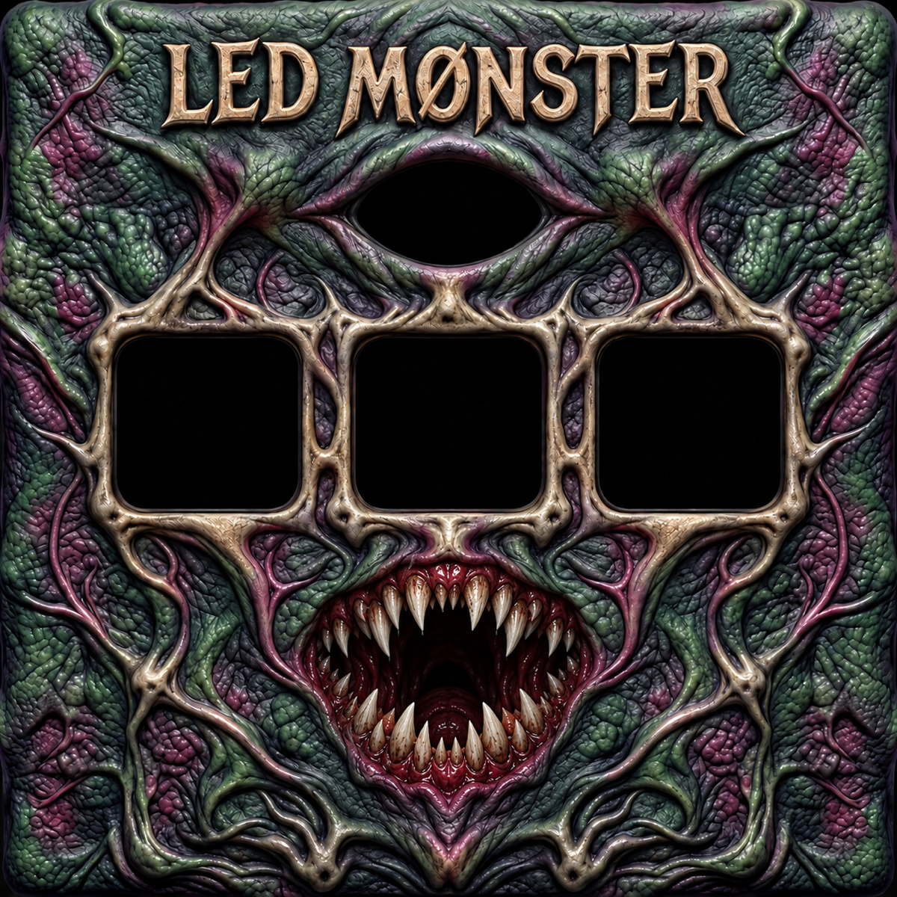

# LED MØNSTER — macOS Bluetooth RGB LED Controller

[](https://github.com/DontxSleep/LED-Monster/releases/latest)
[](https://github.com/DontxSleep/LED-Monster/releases/latest)
[](https://github.com/DontxSleep/LED-Monster/releases/latest)
[](https://www.swift.org/)

**LED MØNSTER is a native macOS Bluetooth LED strip controller for compatible `BJ_LED_M` / MohuanLED RGB controllers.** It combines momentary performance pads, QWERTY and MIDI input, mood lighting, colour effects, and a detailed Bluetooth connection view in one monster-themed interface.



## Download LED MØNSTER

| Download | Best for |
| --- | --- |
| [**LED Monster.dmg**](https://github.com/DontxSleep/LED-Monster/releases/latest/download/LED.Monster.dmg) | Normal drag-to-Applications installation |
| [**LED Monster.zip**](https://github.com/DontxSleep/LED-Monster/releases/latest/download/LED.Monster.zip) | Portable archive containing the Mac app and usage guide |
| [**Source code**](https://github.com/DontxSleep/LED-Monster/archive/refs/heads/main.zip) | Building or reviewing the Swift source |

Current release: **0.15.1 build 25**. Requires an Apple Silicon Mac and macOS 13 or later.

The downloadable app is ad-hoc signed for personal use and is not Apple-notarized. macOS may ask you to approve it the first time it opens.

## What it does

- Controls compatible `BJ_LED_M` Bluetooth RGB LED strip controllers.
- Provides nine momentary colour pads mapped to **Q W E R T Y A S D**.
- Accepts MIDI notes **60–68** on every MIDI channel and exposes a virtual MIDI output.
- Changes the monster eye to the active pad colour while the key or MIDI note is held.
- Includes **Mood mode** with Relax, Sunset, Ocean, Forest, Focus, and Midnight.
- Includes **LED MØNSTER VFX** with five flash/fade patterns, tap tempo, and a 16-colour palette.
- Includes a colour wheel, RGB controls, hex input, brightness, and saved scenes.
- Keeps scenes and diagnostic reports on the Mac with no account or telemetry.

## Quick start

1. Download and open **LED Monster.dmg**.
2. Drag **LED MØNSTER.app** into **Applications**.
3. Power on the LED strip and close MohuanLED or any other app using the controller.
4. Open LED MØNSTER, click the menu button in the top-left, and select **Scan nearby**.
5. Choose the device named **BJ_LED_M**, click **Connect**, and close the menu.
6. Hold a colour pad, its keyboard key, or its matching MIDI note. The light stays on until you release it.

Read [How to use LED MØNSTER](docs/HOW-TO-USE.md) for connection help, controls, MIDI mapping, Mood mode, VFX, and troubleshooting.

## Controls

| Key | Colour | MIDI note |
| --- | --- | --- |
| Q | Red | 60 |
| W | Green | 61 |
| E | Blue | 62 |
| R | Yellow | 63 |
| T | Cyan | 64 |
| Y | Magenta | 65 |
| A | Orange gradient midpoint | 66 |
| S | Spring-green gradient midpoint | 67 |
| D | Violet gradient midpoint | 68 |

## Programme modes

1. **LED MØNSTER** — momentary colour pads with keyboard and MIDI control.
2. **LED MØNSTER VFX** — automatic flash, jump, fade, and BPM-synchronised effects.
3. **Mood mode** — slow ambient crossfades with six curated atmospheres.
4. **Colour studio** — colour wheel, RGB/hex values, brightness, and saved scenes.
5. **Connection details** — discovered GATT services, characteristics, values, and activity logs.

## Hardware compatibility

LED MØNSTER intentionally restricts control writes to devices that match the verified profile:

- Advertised name: `BJ_LED_M`
- BLE service: `EEA0`
- Writable command characteristic: `EE01`
- Colour and power packets: documented in [PROTOCOL.md](PROTOCOL.md)

Other Bluetooth LED controllers may appear during scanning, but this build does not send control packets to them. The app cannot read back the strip's actual colour or power state.

## Build from source

You need an Apple Silicon Mac, macOS 13+, and Apple Command Line Tools.

```bash
git clone https://github.com/DontxSleep/LED-Monster.git
cd LED-Monster
bash build.sh
```

The app is created at `artifacts/LED MØNSTER.app`.

To build a verified disk image:

```bash
bash scripts/build-dmg.sh
```

The DMG is created at `artifacts/LED Monster.dmg`.

## Project documentation

- [How to use the app](docs/HOW-TO-USE.md)
- [Bluetooth protocol notes](PROTOCOL.md)
- [Validation history](VALIDATION.md)
- [Release changes](CHANGELOG.md)

## Privacy

LED MØNSTER runs locally. It has no login, cloud backend, advertising, analytics, or telemetry. Bluetooth reports exported from Connection details can contain nearby device identifiers; review a report before sharing it.

## Scope

This is an independent interoperability project for personally owned hardware. It is not affiliated with or endorsed by the manufacturer of MohuanLED or BJ_LED controllers.

